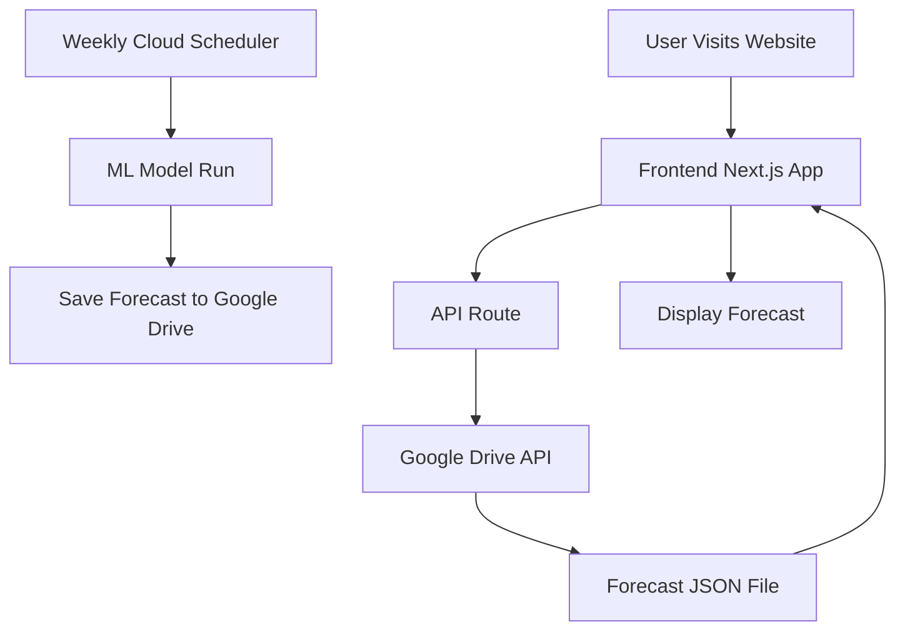

# HAB Project - Bioluminescence Forecast System

A full-stack application that provides weekly bioluminescence forecasts for Scripps Pier, La Jolla, using machine learning models and real-time data visualization.

## System Architecture



### Components

1. **Backend ML System**
   - Weekly scheduled job triggers forecast generation
   - Python-based ML model using pyEDM library
   - Outputs 7-day forecast in JSON format
   - Saves results to Google Drive

2. **Data Storage**
   - Google Drive as primary storage
   - JSON file format for forecast data
   - Service Account for secure access
   - Weekly updates maintain data freshness

3. **Frontend Application**
   - Next.js-based web application
   - Real-time data fetching from Google Drive
   - Responsive design with Tailwind CSS
   - Interactive visualizations
   - Error handling and fallback states

4. **API Layer**
   - Next.js API routes
   - Google Drive API integration
   - Data validation and transformation
   - Error handling and logging

## Setup Guide

1. **Backend Setup**
   - See `/app/README.md` for ML model setup
   - Configure Google Cloud Scheduler
   - Set up Google Drive access

2. **Frontend Setup**
   - See `/frontend/README.md` for detailed setup
   - Configure environment variables
   - Set up Google Drive API access

3. **Deployment**
   - Backend: Cloud Platform of choice
   - Frontend: WordPress hosting
   - Configure cross-origin resource sharing (CORS)

## Data Flow

1. **Weekly Update Process**
   ```
   Cloud Scheduler
   → Trigger ML Model
   → Generate Forecast
   → Save to Google Drive
   ```

2. **User Request Flow**
   ```
   User Visit
   → Next.js Frontend
   → API Route
   → Google Drive
   → Display Data
   ```

## Development

### Prerequisites
- Node.js 18+
- Python 3.8+
- Google Cloud account
- WordPress hosting

### Local Development
```bash
# Frontend
cd frontend
npm install
npm run dev

# Backend
cd app
python -m venv venv
source venv/bin/activate  # or `venv\Scripts\activate` on Windows
pip install -r requirements.txt
python forecast.py
```

## License

This project is licensed under the MIT License - see the LICENSE file for details.

